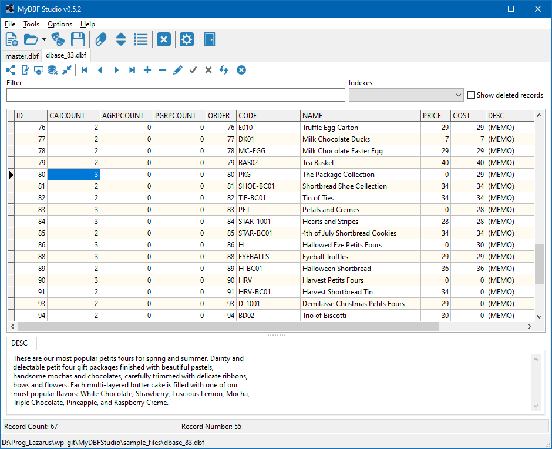

# MyDBFStudio

MyDbf Studio is a multi-platform open source program made with Lazarus that will help you to manage your dbf tables.
The main features are:

* You can work with multiple tables at once, in a tabbed user interface.
* You can directly add, modify or delete data.
* You can view deleted data.
* You can create, empty, delete, change or restructure a table.
* You can create, delete or modify any index in a table.
* You can add or substract two tables.
* You can directly export data in the following formats: CSV, HTML, XLS, DBF, XML or SQL script.
* It works on Windows, Linux and all platforms supported by Lazarus.

The application is distributed as source code. You must compile it with a recent Lazarus version, v2.0 or later.

The program originally was written by <b>Enzo Antonio Calogiuri</b> (aka Fog76), but since the original sources of v0.4.2 were no longer readily available 
I decided to put them onto my github and to refactor some places. Later Enzo published a v0.5 (https://forum.lazarus.freepascal.org/index.php/topic,8954.msg406180.html#msg406180), but since I had some ideas how to improve it I merged the new version and continued with this fork:

* Display memo fields
* Display ansi characters from the table's code page correctly as utf-8.
* Store user settings and the names of recently loaded files in an ini file in the the user's home directory.
* Layout of the controls is determined by anchoring and autosizing and thus should work out in all operating systems supported. Form positions are stored in the ini file.
* Support drag and drop of dbf files from the operating system.
* Optionally, auto-fill the column of the DBGrid displaying the dbf file.
